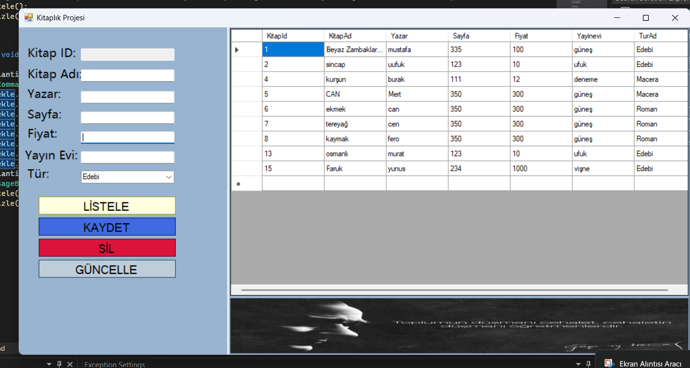

# Kitaplık Projesi

Bu proje, bir kitaplık yönetim sistemidir. Kullanıcılar kitap ekleyebilir, silebilir, güncelleyebilir ve listeleyebilir. Proje, MSSQL veritabanı kullanılarak geliştirilmiştir ve C# Windows Forms ile tasarlanmıştır.

## Özellikler
- Kitap ekleme
- Kitap silme
- Kitap güncelleme
- Kitap listeleme
- MSSQL veritabanı entegrasyonu

## Kullanılan Teknolojiler
- **C# (Windows Forms)**
- **MSSQL**
- **ADO.NET**

## Kurulum
1. **Projeyi Klonla:**
   ```sh
   https://github.com/SametBas1/My-Library-Project.git
   ```
2. **MSSQL Veritabanını Ayarla:**
   - `kitaplik.sql` dosyasını çalıştırarak gerekli tabloları oluştur.
3. **Bağlantı Dizesini Güncelle:**
   - `App.config` veya kod içinde yer alan bağlantı stringini kendi MSSQL bilgilerine göre güncelle.
4. **Projeyi Çalıştır:**
   - Visual Studio ile projeyi aç ve `F5` tuşuna basarak çalıştır.

## Veritabanı Tablosu
```sql
CREATE TABLE Tbl_Kitaplar (
    KitapId INT PRIMARY KEY IDENTITY,
    KitapAd NVARCHAR(100),
    Yazar NVARCHAR(100),
    Sayfa INT,
    Fiyat DECIMAL(10,2),
    Yayinevi NVARCHAR(100),
    Tur NVARCHAR(50)
);
```

## Ekran Görüntüsü


